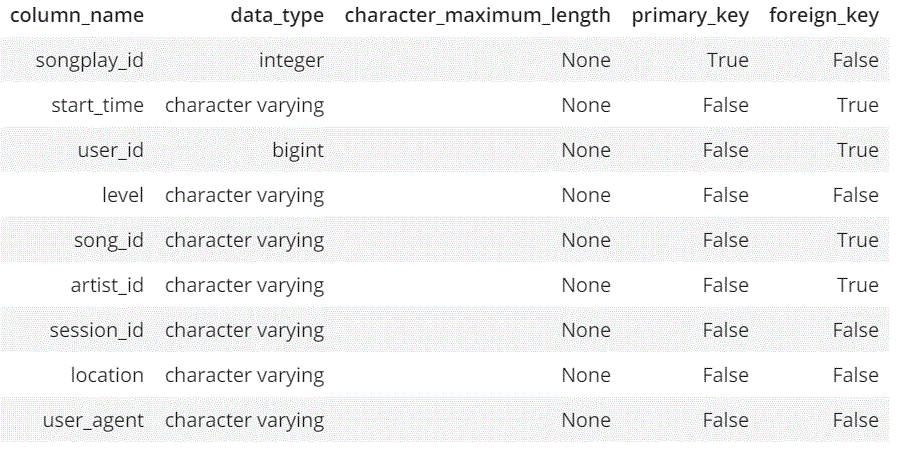

# Sparkify's ETL Process and Database

The goal of this project is to create a database and a ETL to collect songs and user activity on Sparkify streaming app. The analytical goal is to understand what songs users are listening by querying data. The ETL can import files from a S3 buckets of JSON logs on user activity and metadata of the songs in the Sparkify.

To achieve this, this project uses the power of python (with panda) with AWS Redshift database, in a star schema. All the tables are in **3NF**, all with **Primary Key** and **Foreign Key**. Since Primary key constraint is informational only (they are not enforced by Redshift), this project had to garantee that there is no duplicated records.

A **Star schema* was used for several reasons like: Simplicity, lack of many-to-many relations and just one level of Dimensions Tables.

The **SQL code** is intentionally separated from the Python code, creating an easy way of maintaining the database.

# Files

**README.md**: This File

**sql_queries**: All the SQL statements (CREATE, DELETE, INSERT)

**dwh.cfg**: Config File

**create_tables.py**: ETL Pipeline to create the Postgres database

**etl.py**: ETL pipeline to load the data into the Postgres Database

**etl.ipynb**: jupyter notebook of ETL process

**test.ipynb**: jupyter notebook of ETL test

# Song Dataset
The first dataset is a subset of real data from the Million Song Dataset. Each file is in JSON format and contains metadata about a song and the artist of that song. The files are partitioned by the first three letters of each song's track ID. For example, here are filepaths to two files in this dataset.

	song_data/A/B/C/TRABCEI128F424C983.json
	song_data/A/A/B/TRAABJL12903CDCF1A.jso
 
And below is an example of what a single song file, TRAABJL12903CDCF1A.json, looks like.

	{"num_songs": 1, "artist_id": "ARJIE2Y1187B994AB7", "artist_latitude": null, "artist_longitude": null, "artist_location": "", "artist_name": "Line Renaud", "song_id": "SOUPIRU12A6D4FA1E1", "title": "Der Kleine Dompfaff", "duration": 152.92036, "year": 0}

# Log Dataset
The second dataset consists of log files in JSON format generated by this event simulator based on the songs in the dataset above. These simulate app activity logs from an imaginary music streaming app based on configuration settings.

The log files in the dataset you'll be working with are partitioned by year and month. For example, here are filepaths to two files in this dataset.

  log_data/2018/11/2018-11-12-events.json
  log_data/2018/11/2018-11-13-events.json

And below is an example of what the data in a log file, 2018-11-12-events.json, looks like.

# How to Run

First at all, create the tables by running **create_table.py**. This can be done by executing the following in shell:
#python create_tables.py

Second, load the tables from the S3 Bucket
#python etl.py

You are read to go.

# Database Description
As declared above, this project uses Database Star Schema, as shown below:

### songplays table
That is the fact table. It contains records in log data associated with song plays.
It's distribution style is by key and has user_id  as distkey and sortkey

**songplays structure:**

**songplays sample:**

### users table
Dimension table. It contains user records in the app (First and Last name) and the type of subscription they have (free or paid).
It's distribution style is by "all" with user_id as PRIMARY KEY and sortkey

**users structure:**

**users sample:**

### songs table
Dimension table. Comprehensive list of songs in music database.
It's distribution style is by "all" with song_id as PRIMARY KEY and sortkey

**songs structure:**

**songs sample:**

### artists table
Dimension table. Comprehensive list of artists in music database, including location.
It's distribution style is by "all" with artist_id as PRIMARY KEY and sortkey

**artists structure:**

**artists sample:**

### time table
Dimension table. Timestamps of records in songplays broken down into specific units.
It's distribution style is by "all" with start_time as PRIMARY KEY and sortkey

**time structure:**

**time sample:**

